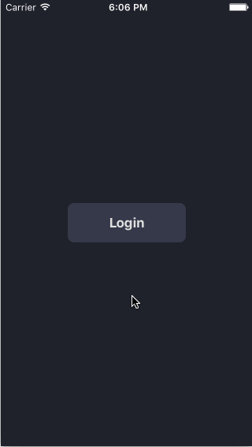

# SmartStream - an iOS app

This is a group project for [CodePath iOS Bootcamp](http://courses.codepath.com/courses/intro_to_ios).

Members:

- Hugo (Hieu) Nguyen
- Jerry Lao
- Marc Adam Anderson

# What is it?
An app that lets you turn any subject into a personalized, 24/7 TV channel. A Pandora-for-videos, if you will.

# User stories

- User can search for a topic and the app will automatically create and autoplay a channel based on that subject
- User can add more than one topic to his/her channel
- User can switch between 2 different modes on a channel: "discovery" or "in-depth"
- User can edit/save the channel
  1. for editing, user can choose among a couple of different sources (Youtube/Vimeo to start with)
  2. for saving, the user would be able to easily view the list of channels he/she current has. When the app launches it will default to auto-playing the channel he/she was watching previously. This fits nicely with the goal of the app which makes consuming content interaction-free and requires as few touches as possible
- User can browse for recommended / suggested channels

Nice-to-haves:

- User can like/dislike individual content in the channel; disliking something will also skip the channel forward
- User can filter content: prefer specific content producers / sources,  or to blacklist topics/sources/producers
- User can choose a theme, among possibly a set of predefined themes, for their channels
- User can link their Youtube / Twitter / Facebook / Vimeo accounts for better personalization
- User can share the channels with their friends or on social media
- User can see and watch their friends' public channels
- User can see all of their 'likes'

# Wireframes

# Initial UI Designs

 

# Walkthrough

# Trello Task Board

# Tips

Evaluating Ideas
Keep in mind the following points when deciding on an app idea with your team:

Incorporates at least 2 mobile-oriented features
This includes maps, camera, location, audio, sensors, push, real-time, etc
Habit-forming apps that could be frequently used by the target audience are best.
Focus on apps that would make for a good 5-minute demo on Demo Day.
Could be published to the App Store and downloaded and used by people within 4 weeks.
Retrieves data from the network and presents this data within the app.
Creation or update aspects that allow the user to engage with your app further.
Our goal is to infuse with you not just technical but also product knowledge. You need to be able to tell a great story to convince people of your ideas. If you're trying to raise funding for a startup idea, you'll need to sell investors on your story. If you're trying to recruit other engineers, you need to be able to articulate these points to convince them to join you.

Demo-centric Planning
When designing your app, be sure to consider a demo-centric approach to planning. At the end of this bootcamp, your team will be presenting a 5-min live demo of your app. Consider the following aspects of the demo:

Start with a description of a problem that your app addresses
Follow-up with a succinct description of the solution your app provides
Create a setup with a few characters and a narrative for how they are using your app
Spend 10 minutes discussing this demo with your team from the outset and consider planning your app around an effective demo. Once development starts, plan sprints based on the minimum viable product needed to execute that demo.

Wireframing
Be sure to send digital versions of your wireframes by Monday, February 29th included in a GitHub repo along with a README with an issue raised for us to review. A few tips for the wireframes expected:

Can be photos of sketched paper wireframes or using a wireframing tool.
These are primarily interaction wireframes and do not need to be visually detailed.
Think through the end-to-end flow of your application and wireframe that entire flow.
Identify each screen of your app. What does each screen do? How do you navigate to other screens?
Illustrate the content and fields displayed to the user.
Think through what information should be collected on creation of new content.
Remember that the more thought you put in with your team now, the easier the development sprints will be starting next week.

## License

Copyright [2016]